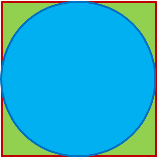
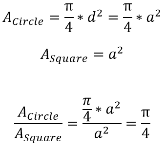
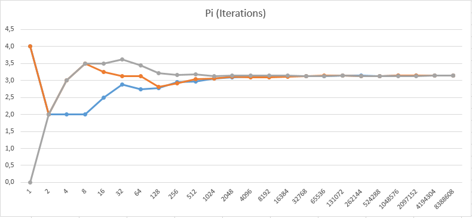

# CalculatePiByChance
Using random points in a square with an inner circle to calculate Pi approximately.

##Description

If you draw a circle inside a square, the diameter is equal to the square's height and width.

;

The fourfold ratio of the area of both shapes equals Pi.

;

##Parameter
The higher the number of iterations (= number of points in square) the more exact Pi is calculated.
;

